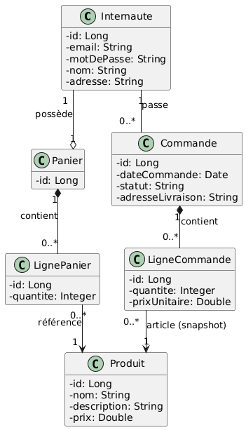
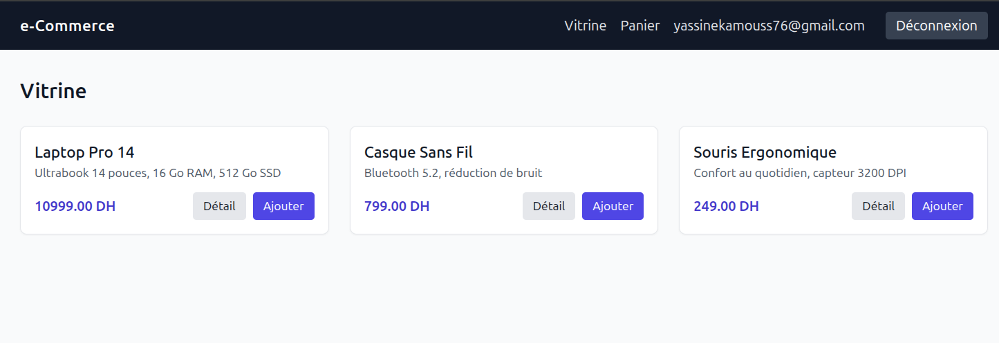
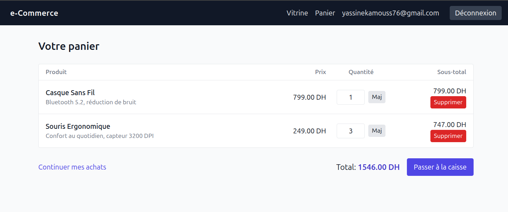
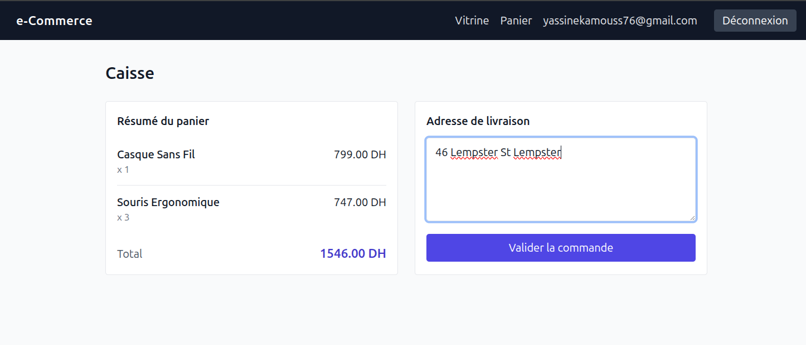
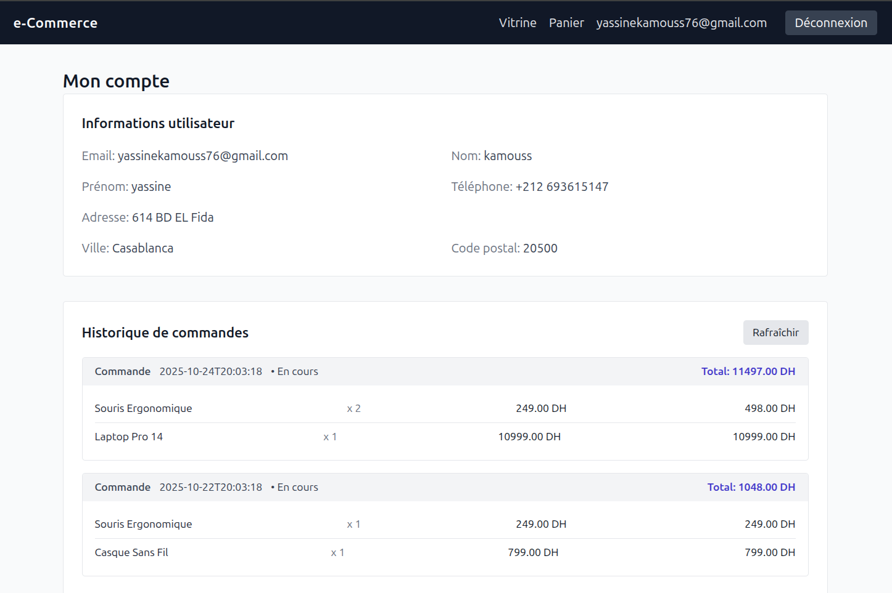
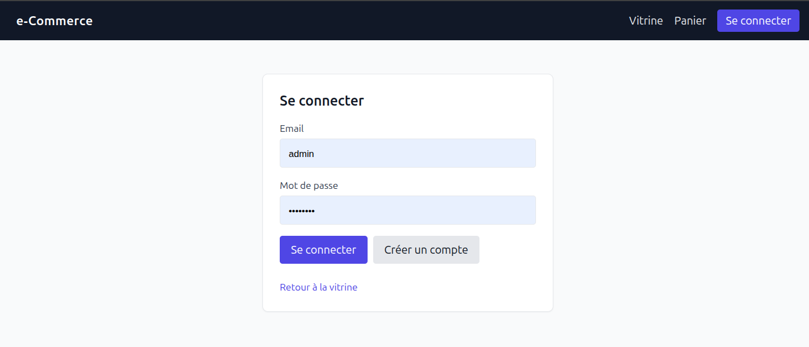

[//]: # (# e‑Commerce JSF — Rapport de projet)

[//]: # ()
[//]: # (Ce document présente le rapport technique du projet e‑commerce réalisé en Jakarta EE &#40;JSF/CDI/JPA&#41; avec Hibernate, et une interface sobre stylée via Tailwind CSS &#40;CDN&#41;.)

[//]: # ()
[//]: # (- Dépôt: ce module produit un WAR &#40;Java 21&#41; déployable sur un serveur Jakarta EE.)

[//]: # (- Interface: pages JSF &#40;vitrine, panier, caisse, confirmation, compte, login&#41;.)

[//]: # (- Persistance: JPA/Hibernate avec les entités métier; configuration `persistence.xml` à compléter selon l’environnement cible.)

[//]: # ()
[//]: # (## Sommaire)

[//]: # (- [Fonctionnalités]&#40;#fonctionnalités&#41;)

[//]: # (- [Architecture et technologies]&#40;#architecture-et-technologies&#41;)

[//]: # (- [Diagramme de classes UML]&#40;#diagramme-de-classes-uml&#41;)

[//]: # (- [Captures d’écran]&#40;#captures-décran&#41;)

[//]: # (- [Structure du projet]&#40;#structure-du-projet&#41;)

[//]: # (- [Construction et exécution]&#40;#construction-et-exécution&#41;)

[//]: # (- [Données d’exemple &#40;SQL&#41;]&#40;#données-dexemple-sql&#41;)

[//]: # (- [Améliorations possibles]&#40;#améliorations-possibles&#41;)

[//]: # ()
[//]: # (## Fonctionnalités)

[//]: # (- Parcourir les produits &#40;vitrine&#41; et voir un détail simple.)

[//]: # (- Authentification/inscription d’un internaute.)

[//]: # (- Gestion d’un panier session &#40;ajout, suppression, modification des quantités, total&#41;.)

[//]: # (- Passage de commande &#40;saisie d’adresse, copie des lignes de panier en lignes de commande, vidage du panier&#41;.)

[//]: # (- Historique de commandes de l’utilisateur connecté.)

[//]: # ()
[//]: # (## Architecture et technologies)

[//]: # (- Langage: Java 21)

[//]: # (- Plateforme: Jakarta EE 11 &#40;JSF 4, CDI 4.1, JPA 3.2&#41;)

[//]: # (- ORM: Hibernate ORM 7)

[//]: # (- Vue: JSF &#40;Facelets&#41;, Tailwind CSS via CDN)

[//]: # (- Build: Maven &#40;packaging WAR&#41;)

[//]: # (- Modèle principal:)

[//]: # (  - Internaute, Produit, Panier, LignePanier, Commande, LigneCommande)

[//]: # ()
[//]: # (## Diagramme de classes UML)

[//]: # (Le diagramme ci-dessous illustre les entités métier et leurs relations &#40;OneToOne, OneToMany/ManyToOne&#41;:)

[//]: # ()
[//]: # (![Diagramme de classes]&#40;docs/class_diagram.png&#41;)

[//]: # ()
[//]: # (## Captures d’écran)

[//]: # (Les captures suivantes &#40;wireframes&#41; donnent un aperçu de l’interface.)

[//]: # ()
[//]: # (- Vitrine: ![Vitrine]&#40;docs/vitrine.png&#41;)

[//]: # (- Panier: ![Panier]&#40;docs/panier.png&#41;)

[//]: # (- Caisse: ![Caisse]&#40;docs/caisse.png&#41;)

[//]: # (- Compte: ![Compte]&#40;docs/compte.png&#41;)

[//]: # (- Connexion: ![Connexion]&#40;docs/login.png&#41;)

[//]: # ()
[//]: # (## Structure du projet)

[//]: # (```)

[//]: # (src/)

[//]: # (  main/)

[//]: # (    java/)

[//]: # (      com/fstt/atelier3/ecommercejsf/)

[//]: # (        model/        # Entités JPA &#40;Internaute, Produit, Panier, LignePanier, Commande, LigneCommande&#41;)

[//]: # (        controller/    # Beans JSF/CDI &#40;AuthBean, VitrineBean, PanierBean, CommandeBean&#41;)

[//]: # (    resources/)

[//]: # (      META-INF/persistence.xml  # Unité de persistance à paramétrer)

[//]: # (    webapp/)

[//]: # (      vues/          # Pages JSF &#40;Facelets&#41;)

[//]: # (      WEB-INF/       # faces-config.xml, web.xml, includes)

[//]: # (pom.xml              # Maven, packaging WAR)

[//]: # (```)

[//]: # ()
[//]: # (## Construction et exécution)

[//]: # (- Construction du WAR:)

[//]: # (```bash)

[//]: # (./mvnw -DskipTests package)

[//]: # (```)

[//]: # (- Déploiement: copier `target/e-commerceJSF-1.0-SNAPSHOT.war` dans votre serveur Jakarta EE compatible &#40;CDI/JSF/JPA&#41;.)

[//]: # (- Configuration JPA: compléter `src/main/resources/META-INF/persistence.xml` &#40;datasource, dialecte, ddl&#41;. Exemple &#40;développement&#41; avec H2/MySQL selon besoin.)

[//]: # ()
[//]: # (## Données d’exemple &#40;SQL&#41;)

[//]: # (Pour insérer des produits, un panier, des commandes et des lignes &#40;en supposant un internaute id=1&#41;:)

[//]: # ()
[//]: # (```sql)

[//]: # (START TRANSACTION;)

[//]: # ()
[//]: # (-- Créer le panier de l’internaute #1 s’il n’existe pas)

[//]: # (INSERT IGNORE INTO paniers &#40;internaute_id&#41; VALUES &#40;1&#41;;)

[//]: # (SET @panier_id := &#40;SELECT id FROM paniers WHERE internaute_id = 1&#41;;)

[//]: # ()
[//]: # (-- Produits)

[//]: # (INSERT INTO produits &#40;nom, prix, description, stock&#41; VALUES)

[//]: # (  &#40;'Laptop Pro 14',     10999.00, 'Ultrabook 14 pouces, 16 Go RAM, 512 Go SSD', 12&#41;,)

[//]: # (  &#40;'Casque Sans Fil',     799.00, 'Bluetooth 5.2, réduction de bruit',          50&#41;,)

[//]: # (  &#40;'Souris Ergonomique',  249.00, 'Confort au quotidien, capteur 3200 DPI',    120&#41;;)

[//]: # ()
[//]: # (SET @p1 := &#40;SELECT id FROM produits WHERE nom = 'Laptop Pro 14'      LIMIT 1&#41;;)

[//]: # (SET @p2 := &#40;SELECT id FROM produits WHERE nom = 'Casque Sans Fil'    LIMIT 1&#41;;)

[//]: # (SET @p3 := &#40;SELECT id FROM produits WHERE nom = 'Souris Ergonomique' LIMIT 1&#41;;)

[//]: # ()
[//]: # (-- Lignes panier)

[//]: # (INSERT INTO lignes_panier &#40;panier_id, produit_id, quantite&#41; VALUES)

[//]: # (  &#40;@panier_id, @p2, 1&#41;,)

[//]: # (  &#40;@panier_id, @p3, 3&#41;;)

[//]: # ()
[//]: # (-- Commande 1 &#40;aujourd’hui&#41;)

[//]: # (INSERT INTO commandes &#40;date_commande, statut, adresse_livraison, internaute_id&#41;)

[//]: # (VALUES &#40;NOW&#40;&#41;, 'En cours', '123 Rue Atlas, Agadir 80000', 1&#41;;)

[//]: # (SET @cmd1 := LAST_INSERT_ID&#40;&#41;;)

[//]: # (INSERT INTO lignes_commande &#40;commande_id, produit_id, produit_nom, prix_unitaire, quantite&#41; VALUES)

[//]: # (  &#40;@cmd1, @p1, 'Laptop Pro 14',       10999.00, 1&#41;,)

[//]: # (  &#40;@cmd1, @p3, 'Souris Ergonomique',    249.00, 2&#41;;)

[//]: # ()
[//]: # (-- Commande 2 &#40;il y a 2 jours&#41;)

[//]: # (INSERT INTO commandes &#40;date_commande, statut, adresse_livraison, internaute_id&#41;)

[//]: # (VALUES &#40;DATE_SUB&#40;NOW&#40;&#41;, INTERVAL 2 DAY&#41;, 'En cours', '123 Rue Atlas, Agadir 80000', 1&#41;;)

[//]: # (SET @cmd2 := LAST_INSERT_ID&#40;&#41;;)

[//]: # (INSERT INTO lignes_commande &#40;commande_id, produit_id, produit_nom, prix_unitaire, quantite&#41; VALUES)

[//]: # (  &#40;@cmd2, @p2, 'Casque Sans Fil',  799.00, 1&#41;,)

[//]: # (  &#40;@cmd2, @p3, 'Souris Ergonomique', 249.00, 1&#41;;)

[//]: # ()
[//]: # (COMMIT;)

[//]: # (```)

[//]: # ()
[//]: # (> Remarque: veillez à avoir un `internautes.id = 1` existant. Les noms/colonnes correspondent aux entités JPA.)

[//]: # ()
[//]: # (## Améliorations possibles)

[//]: # (- Validation côté vue &#40;JSF&#41; et messages utilisateur &#40;FacesMessage&#41; plus riches.)

[//]: # (- Converters/formatters pour les montants.)

[//]: # (- Gestion des stocks &#40;décrément lors de la commande&#41;.)

[//]: # (- Sécurisation &#40;authz&#41; fine des pages et actions.)

[//]: # (- Intégration d’un provider mail pour confirmation.)

[//]: # (- Tests d’intégration &#40;Arquillian/Testcontainers&#41; et pipeline CI.)

[//]: # ()


# Rapport de Projet : Site e-Commerce JSF

Ce document constitue le rapport technique de l'atelier N°3, consistant en la réalisation d'une application web e-commerce. Le projet met en œuvre une pile Jakarta EE moderne (JSF/CDI/JPA) avec une interface utilisateur sobre stylisée via Tailwind CSS (CDN).

- **Livrable :** Le projet produit une archive `WAR` (Java 21) prête à être déployée sur un serveur d'applications compatible Jakarta EE 11 (ex: WildFly).
- **Persistance :** La couche de persistance est gérée par JPA/Hibernate, avec une configuration centralisée dans `persistence.xml`.

---

## Sommaire

- [1. Objectif de l'Atelier](#1-objectif-de-latelier)
- [2. Fonctionnalités Implémentées](#2-fonctionnalités-implémentées)
- [3. Architecture et Technologies](#3-architecture-et-technologies)
- [4. Diagramme de Classes UML](#4-diagramme-de-classes-uml)
- [5. Aperçu de l'Interface](#5-aperçu-de-linterface)
- [6. Structure du Projet](#6-structure-du-projet)
- [7. Guide d'Installation et de Déploiement](#7-guide-dinstallation-et-de-déploiement)
    - [Prérequis](#prérequis)
    - [Étape 1 : Configuration de la Base de Données (MySQL)](#étape-1--configuration-de-la-base-de-données-mysql)
    - [Étape 2 : Configuration du Serveur WildFly (Datasource)](#étape-2--configuration-du-serveur-wildfly-datasource)
    - [Étape 3 : Configuration de l'Unité de Persistance (JPA)](#étape-3--configuration-de-lunité-de-persistance-jpa)
    - [Étape 4 : Construction et Déploiement](#étape-4--construction-et-déploiement)
    - [Étape 5 : Peuplement de la Base de Données](#étape-5--peuplement-de-la-base-de-données)
- [8. Améliorations Possibles](#8-améliorations-possibles)

---

## 1. Objectif de l'Atelier

L’objectif principal de cet atelier était de maîtriser l’API **Jakarta Persistence (JPA)** et le framework **Jakarta Server Faces (JSF)** pour construire une application web transactionnelle complète.

Les compétences visées incluent :
- Le mapping Objet-Relationnel (ORM) d'un modèle de données métier.
- La gestion des transactions (JTA) et du cycle de vie des entités via l'`EntityManager`.
- La construction d'une interface utilisateur (UI) à base de composants avec JSF (Facelets).
- L'utilisation de **CDI (Contexts and Dependency Injection)** pour lier les couches et gérer l'état (ex: `@SessionScoped`, `@RequestScoped`).

## 2. Fonctionnalités Implémentées

- **Gestion des produits :** Consultation de la vitrine et des détails d'un produit.
- **Gestion des Internautes :** Inscription et authentification d'un utilisateur.
- **Gestion du Panier :** Un panier (`@SessionScoped`) est associé à chaque utilisateur connecté.
    - Ajout, suppression, et modification des quantités.
    - Calcul dynamique du sous-total et du total.
- **Processus de Commande :**
    - Validation du panier et saisie d'une adresse de livraison.
    - Transformation du `Panier` en une `Commande` persistante.
    - Copie des `LignePanier` en `LigneCommande` pour figer l'historique d'achat.
    - Vidage automatique du panier après la confirmation.
- **Espace Client :** Consultation de l'historique des commandes passées par l'utilisateur connecté.

## 3. Architecture et Technologies

### Pile Technologique

- **Langage :** Java 21
- **Plateforme :** Jakarta EE 11 (JSF 4, CDI 4.1, JPA 3.2)
- **Serveur d'Application :** WildFly
- **Base de Données :** MySQL
- **ORM :** Hibernate ORM 7
- **Vue (Frontend) :** JSF (Facelets) avec la bibliothèque de composants PrimeFaces.
- **Styling :** Tailwind CSS via CDN (pour un prototypage rapide de l'UI).
- **Build :** Apache Maven (packaging `WAR`).

### Architecture MVC

L'application respecte le patron de conception **Modèle-Vue-Contrôleur (MVC)**, adapté à l'écosystème Jakarta EE :

- **Modèle (Model) :** Les entités JPA (ex: `Produit`, `Commande`, `Internaute`) situées dans le package `model`. Elles représentent la structure des données. La logique d'accès est gérée par l'`EntityManager` injecté par JPA.
- **Vue (View) :** Les pages JSF (Facelets) (`.xhtml`) situées dans `/webapp/vues/`. Elles définissent l'interface utilisateur et sont liées aux contrôleurs via l'Expression Language (EL) de JSF (ex: `#{vitrineBean.produits}`).
- **Contrôleur (Controller) :** Les Beans CDI (`@Named`) situés dans le package `controller`. Ils servent de pont entre la Vue et le Modèle, contiennent la logique métier, et gèrent l'état de l'application (ex: `AuthBean` en `@SessionScoped`, `VitrineBean` en `@RequestScoped`).

## 4. Diagramme de Classes UML

Le diagramme suivant illustre le modèle de données (les entités JPA) et leurs relations.



## 5. Aperçu de l'Interface

Les captures suivantes (basées sur des wireframes) illustrent les écrans principaux de l'application.

| Vitrine | Panier |
| :---: | :---: |
|  |  |
| **Caisse (Checkout)** | **Mon Compte (Historique)** |
|  |  |
| **Connexion** |
|  |

## 6. Structure du Projet

L'arborescence du projet est organisée pour séparer clairement les responsabilités (logique, données, vues).

```pgsql
src/
└── main/
    ├── java/
    │   └── com/
    │       └── fstt/
    │           └── atelier3/
    │               └── ecommercejsf/
    │                   ├── model/         # Entités JPA (Internaute, Produit, Panier, etc.)
    │                   └── controller/    # Beans JSF / CDI (AuthBean, VitrineBean, etc.)
    ├── resources/
    │   └── META-INF/
    │       └── persistence.xml            # Config de l’unité de persistance
    └── webapp/
        ├── vues/                          # Pages JSF (Facelets)
        ├── WEB-INF/
        │   ├── faces-config.xml           # Config JSF (minimal)
        │   ├── web.xml                    # Déclaration de la FacesServlet
        │   └── beans.xml                  # Activation CDI
        ├── includes/                      # Fragments de page (header.xhtml, etc.)
        └── index.xhtml                    # Point d'entrée (vitrine)                                  
    ├── pom.xml  # Fichier Maven (dépendances et build)
```

---

## 7. Guide d'Installation et de Déploiement

### Prérequis

- JDK 11 ou supérieur
- Apache Maven 3.6+
- Serveur WildFly (recommandé)
- Serveur MySQL

### Étape 1 : Configuration de la Base de Données (MySQL)

Assurez-vous que votre service MySQL est en cours d'exécution. Créez une base de données et un utilisateur dédié.

```sql
CREATE DATABASE db_ecommerce DEFAULT CHARACTER SET utf8mb4 COLLATE utf8mb4_unicode_ci;
CREATE USER 'ecommerce_user'@'localhost' IDENTIFIED BY 'votre_mot_de_passe_securise';
GRANT ALL PRIVILEGES ON db_ecommerce.* TO 'ecommerce_user'@'localhost';
FLUSH PRIVILEGES;
```

### Étape 2 : Configuration du Serveur WildFly (Datasource)

Pour que l'application puisse communiquer avec la BDD, un **Datasource JTA** doit être configuré dans WildFly.

1.  **Déployer le Driver JDBC :**
    Copiez le fichier `.jar` du connecteur MySQL (ex: `mysql-connector-j-X.X.jar`) dans le dossier `[WILDFLY_HOME]/standalone/deployments/`.

2.  **Configurer `standalone.xml` :**
    Ouvrez le fichier `[WILDFLY_HOME]/standalone/configuration/standalone.xml` et ajoutez les blocs suivants :

    * Sous `<subsystem xmlns="urn:jboss:domain:datasources:6.0"> <datasources>`:

    ```xml
    <datasource jndi-name="java:jboss/datasources/MySQLECommerceDS" pool-name="MySQLECommercePool">
        <connection-url>jdbc:mysql://localhost:3306/db_ecommerce</connection-url>
        <driver>mysql</driver>
        <security>
            <user-name>ecommerce_user</user-name>
            <password>votre_mot_de_passe_securise</password>
        </security>
    </datasource>
    ```

    * Sous `<drivers>` (au sein du même subsystem):

    ```xml
    <driver name="mysql" module="com.mysql">
        <driver-class>com.mysql.cj.jdbc.Driver</driver-class>
    </driver>
    ```

### Étape 3 : Configuration de l'Unité de Persistance (JPA)

Le fichier `src/main/resources/META-INF/persistence.xml` est le cœur de JPA. Il doit déclarer le datasource JTA configuré à l'étape 2.

```xml
<?xml version="1.0" encoding="UTF-8"?>
<persistence version="3.0"
             xmlns="[http://xmlns.jcp.org/xml/ns/persistence](http://xmlns.jcp.org/xml/ns/persistence)"
             xmlns:xsi="[http://www.w3.org/2001/XMLSchema-instance](http://www.w3.org/2001/XMLSchema-instance)"
             xsi:schemaLocation="[http://xmlns.jcp.org/xml/ns/persistence](http://xmlns.jcp.org/xml/ns/persistence) [http://xmlns.jcp.org/xml/ns/persistence/persistence_3_0.xsd](http://xmlns.jcp.org/xml/ns/persistence/persistence_3_0.xsd)">

    <persistence-unit name="ecommerce-pu" transaction-type="JTA">
        <!-- 1. Référence au Datasource JTA de WildFly -->
        <jta-data-source>java:jboss/datasources/MySQLECommerceDS</jta-data-source>

        <!-- 2. Liste des entités -->
        <class>com.fstt.atelier3.ecommercejsf.model.Internaute</class>
        <class>com.fstt.atelier3.ecommercejsf.model.Produit</class>
        <class>com.fstt.atelier3.ecommercejsf.model.Panier</class>
        <class>com.fstt.atelier3.ecommercejsf.model.LignePanier</class>
        <class>com.fstt.atelier3.ecommercejsf.model.Commande</class>
        <class>com.fstt.atelier3.ecommercejsf.model.LigneCommande</class>

        <properties>
            <!-- 3. Configuration d'Hibernate -->
            <property name="hibernate.dialect" value="org.hibernate.dialect.MySQLDialect"/>
            <property name="hibernate.hbm2ddl.auto" value="update"/>
            <property name="hibernate.show_sql" value="true"/>
            <property name="hibernate.format_sql" value="true"/>
        </properties>
    </persistence-unit>
</persistence>
```


### Étape 4 : Configuration du Serveur WildFly (Datasource)

Pour que l'application puisse communiquer avec la BDD, un **Datasource JTA** doit être configuré dans WildFly.

1.  Ouvrez un terminal à la racine du projet (où se trouve pom.xml).
2.  Lancez le build Maven :
    
```bash
̀̀      ./mvnw -DskipTests package
```
(ou mvnw.cmd -DskipTests package si vous êtes sous Windows)

3. Déployez l'archive `WAR` générée (située dans le dossier target/) sur votre serveur WildFly (par exemple, en la copiant dans `[WILDFLY_HOME]/standalone/deployments/`).
4. Accédez à l'application (l'URL dépend du nom final de votre WAR) :`http://localhost:8080/e-commerceJSF-1.0-SNAPSHOT/`

### Étape 5 : Peuplement de la Base de Données
Pour tester l'application, vous pouvez insérer des données d'exemple via un client SQL (en supposant qu'un `internautes.id = 1` existe).

```sql
START TRANSACTION;

-- Créer le panier de l’internaute #1 s’il n’existe pas
INSERT IGNORE INTO paniers (internaute_id) VALUES (1);
SET @panier_id := (SELECT id FROM paniers WHERE internaute_id = 1);

-- Produits
INSERT INTO produits (nom, prix, description, stock) VALUES
  ('Laptop Pro 14',     10999.00, 'Ultrabook 14 pouces, 16 Go RAM, 512 Go SSD', 12),
  ('Casque Sans Fil',     799.00, 'Bluetooth 5.2, réduction de bruit',          50),
  ('Souris Ergonomique',  249.00, 'Confort au quotidien, capteur 3200 DPI',    120);

SET @p1 := (SELECT id FROM produits WHERE nom = 'Laptop Pro 14'      LIMIT 1);
SET @p2 := (SELECT id FROM produits WHERE nom = 'Casque Sans Fil'    LIMIT 1);
SET @p3 := (SELECT id FROM produits WHERE nom = 'Souris Ergonomique' LIMIT 1);

-- Lignes panier
INSERT INTO lignes_panier (panier_id, produit_id, quantite) VALUES
  (@panier_id, @p2, 1),
  (@panier_id, @p3, 3);

-- Commande 1 (aujourd’hui)
INSERT INTO commandes (date_commande, statut, adresse_livraison, internaute_id)
VALUES (NOW(), 'En cours', '123 Rue Atlas, Agadir 80000', 1);
SET @cmd1 := LAST_INSERT_ID();
INSERT INTO lignes_commande (commande_id, produit_id, produit_nom, prix_unitaire, quantite) VALUES
  (@cmd1, @p1, 'Laptop Pro 14',       10999.00, 1),
  (@cmd1, @p3, 'Souris Ergonomique',    249.00, 2);

COMMIT;
```

## 8. Améliorations Possibles
Ce projet pose des bases solides. Les prochaines étapes d'amélioration pourraient inclure :
- **Validation Avancée** : Implémenter la validation  `̀jakarta.validation` (Bean Validation) sur les entités et utiliser `<h:message>` dans JSF pour des retours utilisateur plus propres.

- **Sécurité** : Remplacer le stockage de mot de passe en clair par un hachage (ex: BCrypt) et sécuriser les pages par rôle.

- **Gestion des Stocks** : Décrémenter le stock d'un Produit lors de la validation d'une Commande.

- **Tests** : Ajouter des tests d'intégration (ex: Arquillian) pour valider la logique de persistance et métier.

- **Pipeline CI/CD** : Mettre en place un pipeline (ex: GitHub Actions) pour automatiser le build, les tests et le déploiement.